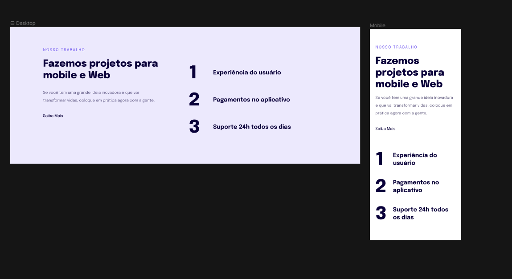

#

## Rocketseat Explorer = Resonsividade - Projeto 04 ✔

- [x] Estrutura HTML
- [x] Regra mobile-first
- [x] Regra das unidades de medidas flexíveis
- [x] Versão Desktop

## Techs

- HTML
- CSS

## Deploy

Você pode conferir o projeto rodando [aqui]().
